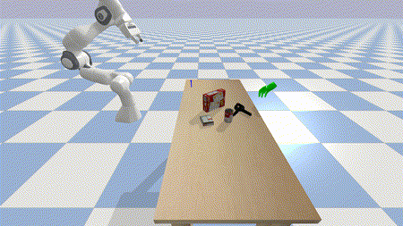
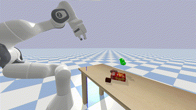
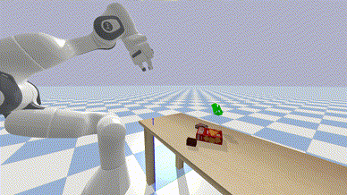
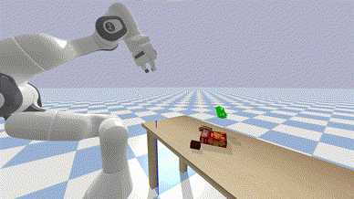
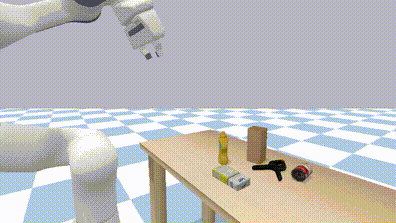
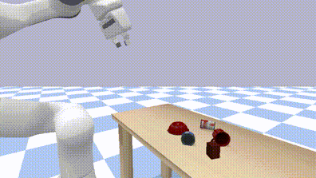

# Handover-Sim

Handover-Sim is a Python-based simulation environment and benchmark for human-to-robot object handovers. The environment and benchmark were initially described in an ICRA 2022 paper:

**HandoverSim: A Simulation Framework and Benchmark for Human-to-Robot Object Handovers**  
Yu-Wei Chao, Chris Paxton, Yu Xiang, Wei Yang, Balakumar Sundaralingam, Tao Chen, Adithyavairavan Murali, Maya Cakmak, Dieter Fox  
IEEE International Conference on Robotics and Automation (ICRA), 2022  
[ [paper](https://handover-sim.github.io/assets/chao_icra2022.pdf) ] [ [video](https://youtu.be/lX3CF4lFKWo) ] [ [arXiv](https://arxiv.org/abs/2205.09747) ] [ [project site](https://handover-sim.github.io) ]

### Citing Handover-Sim

    @INPROCEEDINGS{chao:icra2022,
      author    = {Yu-Wei Chao and Chris Paxton and Yu Xiang and Wei Yang and Balakumar Sundaralingam and Tao Chen and Adithyavairavan Murali and Maya Cakmak and Dieter Fox},
      booktitle = {IEEE International Conference on Robotics and Automation (ICRA)},
      title     = {{HandoverSim}: A Simulation Framework and Benchmark for Human-to-Robot Object Handovers},
      year      = {2022},
    }

### License

Handover-Sim is released under the [BSD 3-Clause License](LICENSE).

### Acknowledgements

This repo is based on a Python project template created by [Rowland O'Flaherty](https://github.com/rowoflo).

### Contents

1. [Prerequisites](#prerequisites)
2. [Installation](#installation)
3. [Running Demos](#running-demos)
4. [Benchmarking Baselines](#benchmarking-baselines)
    1. [Yang et al. ICRA 2021](#yang-et-al-icra-2021)
    2. [OMG Planner](#omg-planner)
    3. [GA-DDPG](#ga-ddpg)
5. [Evaluation](#evaluation)
6. [Reproducing ICRA 2022 Results](#reproducing-icra-2022-results)
7. [Rendering from Result and Saving Rendering](#rendering-from-result-and-saving-rendering)

## Prerequisites

This code is tested with Python 3.8 on Ubuntu 20.04.

## Installation

For good practice for Python package management, it is recommended to install the package into a virtual environment (e.g., `virtualenv` or `conda`).

1. Clone the repo with `--recursive` and and cd into it:

    ```Shell
    git clone --recursive git@github.com:NVlabs/handover-sim.git
    cd handover-sim
    ```

2. Install `handover-sim` as a Python package:

    ```Shell
    pip install -e .
    ```

3. Download MANO models and code (`mano_v1_2.zip`) from the [MANO website](https://mano.is.tue.mpg.de) and place the file under `handover/data/`. Unzip with:

    ```Shell
    cd handover/data
    unzip mano_v1_2.zip
    cd ../..
    ```

    This will extract a folder `handover/data/mano_v1_2/`.

4. Download the DexYCB dataset.

    **Option 1**: Download cached dataset: **(recommended)**

    1. Download [`dex-ycb-cache-20220323.tar.gz`](https://drive.google.com/uc?export=download&id=1Jqe2iqI7inoEdE3BL4vEs25eT5M7aUHd) (507M) and place the file under `handover/data/`. Extract with:

        ```Shell
        cd handover/data
        tar zxvf dex-ycb-cache-20220323.tar.gz
        cd ../..
        ```

        This will extract a folder `handover/data/dex-ycb-cache/`.

    **Option 2**: Download full dataset and cache the data:

    1. Download the DexYCB dataset from the [DexYCB project site](https://dex-ycb.github.io).

    2. Set the environment variable for dataset path:

        ```Shell
        export DEX_YCB_DIR=/path/to/dex-ycb
        ```

        `$DEX_YCB_DIR` should be a folder with the following structure:

        ```Shell
        ├── 20200709-subject-01/
        ├── 20200813-subject-02/
        ├── ...
        ├── calibration/
        └── models/
        ```

    3. Cache the dataset:

        ```Shell
        python handover/data/cache_dex_ycb_data.py
        ```

        The cached dataset will be saved to `handover/data/dex-ycb-cache/`.

5. Compile assets.

    1. Download [`assets-3rd-party-20220511.tar.gz`](https://drive.google.com/uc?export=download&id=1tDiXvW5vwJDOCgK61VEsFaZ7Z00gF0vj) (155M) and place the file under `handover/data/`. Extract with:

        ```Shell
        cd handover/data
        tar zxvf assets-3rd-party-20220511.tar.gz
        cd ../..
        ```

        This will extract a folder `handover/data/assets/` with 3rd party assets. See [handover/data/README.md](./handover/data/README.md) for the source of these assets.

    2. Compile assets:

        ```Shell
        ./handover/data/compile_assets.sh
        ```

        The compiled assets will be saved to `handover/data/assets/`.

## Running Demos

1. Running a handover environment:

    ```Shell
    python examples/demo_handover_env.py \
      SIM.RENDER True
    ```

    

2. Running a planned trajectory:

    ```Shell
    python examples/demo_trajectory.py \
      SIM.RENDER True
    ```

    

3. Running a benchmark wrapper:

    ```Shell
    python examples/demo_benchmark_wrapper.py \
      SIM.RENDER True \
      BENCHMARK.DRAW_GOAL True
    ```

    

    This will run the same trajectory as in `demo_trajectory.py` above but will also draw the goal region in the visualizer window and print out the benchmark status in the terminal.

## Benchmarking Baselines

We benchmarked three baselines on Handover-Sim:

1. **OMG Planner** - [GitHub](https://github.com/liruiw/OMG-Planner)
2. **Yang et al. ICRA 2021** - [arXiv](https://arxiv.org/abs/2011.08961)
3. **GA-DDPG** - [GitHub](https://github.com/liruiw/GA-DDPG)

| OMG Planner | Yang et al. ICRA 2021 |
| :-: | :-: |
|  |  |

| GA-DDPG (hold) | GA-DDPG (w/o hold) |
| :-: | :-: |
|  |  |

As described in the [paper Sec. IV "Training and Evaluation Setup"](https://handover-sim.github.io/assets/chao_icra2022.pdf), we divide the data into different **setups** (`s0`, `s1`, `s2`, `s3`) and **splits** (`train`, `val`, `test`). We benchmarked these baselines on the `test` split of each setup.

Below we provide instructions for setting up and running benchmark for these baselines.

### Yang et al. ICRA 2021

- We have included our implementation of Yang et al. ICRA 2021 in this repo. The following command will run the benchmark on the `test` split of `s0`:

    ```Shell
    python examples/run_benchmark_yang_icra2021.py \
      SIM.RENDER True \
      BENCHMARK.SETUP s0
    ```

    This will open a visualizer window, go through each handover scene in the split, and execute the actions generated from the policy. To run on other setups, replace `s0` with `s1`, `s2`, and `s3`.

- The command above is mostly just for visualization purposes, and thus does not save the benchmark result. To **save the result** for evaluation later, set `BENCHMARK.SAVE_RESULT` to `True`, and remove `SIM.RENDER` to run headless if you don't need the visualizer window:

    ```Shell
    python examples/run_benchmark_yang_icra2021.py \
      BENCHMARK.SETUP s0 \
      BENCHMARK.SAVE_RESULT True
    ```

    The result will be saved to a new folder `results/*_yang-icra2021_*_test/`.

- Once the job finishes, you are ready to run evaluation and see the result. See the [Evaluation](#evaluation) section.

### OMG Planner

- First, you need to install [OMG-Planner](https://github.com/liruiw/OMG-Planner). See [examples/README.md](./examples/README.md) for our documentation for installation steps.

- Once installed, you can run the benchmark on the `test` split of `s0` with the path to OMG-Planner (`OMG_PLANNER_DIR`):

    ```Shell
    OMG_PLANNER_DIR=OMG-Planner python examples/run_benchmark_omg_planner.py \
      SIM.RENDER True \
      BENCHMARK.SETUP s0
    ```

    Like in [Yang et al. ICRA 2021](#yang-et-al-icra-2021), this will open a visualizer window, go through each handover scene in the split, and execute the actions generated from the policy. To run on other setups, replace `s0` with `s1`, `s2`, and `s3`.

- Likewise, the command above is mostly just for visualization purposes, and thus does not save the benchmark result. To **save the result** for evaluation later, set `BENCHMARK.SAVE_RESULT` to `True`, and remove `SIM.RENDER` to run headless if you don't need the visualizer window:

    ```Shell
    OMG_PLANNER_DIR=OMG-Planner python examples/run_benchmark_omg_planner.py \
      BENCHMARK.SETUP s0 \
      BENCHMARK.SAVE_RESULT True
    ```

    The result will be saved to a new folder `results/*_omg-planner_*_test/`.

- Again, once the job finishes, you are ready to run evaluation and see the result. See the [Evaluation](#evaluation) section.

### GA-DDPG

- First, you need to install [GA-DDPG](https://github.com/liruiw/GA-DDPG). See [examples/README.md](./examples/README.md) for our documentation for installation steps.

- Once installed, you can run the benchmark. As described in the [paper Sec. V "Baselines"](https://handover-sim.github.io/assets/chao_icra2022.pdf), we benchmarked **two variants** of this baseline:
    - Hold until the human hand stops as in the OMG Planner ("**GA-DDPG hold**")
    - Without hold ("**GA-DDPG w/o hold**")

- With the path to GA-DDPG (`GADDPG_DIR`), you can now run for "GA-DDPG hold" on the `test` split of `s0` with:

    ```Shell
    GADDPG_DIR=GA-DDPG CUDA_VISIBLE_DEVICES=0 python examples/run_benchmark_gaddpg_hold.py \
      SIM.RENDER True \
      ENV.ID HandoverHandCameraPointStateEnv-v1 \
      BENCHMARK.SETUP s0
    ```

    and for "GA-DDPG w/o hold" on the `test` split of `s0` with:

    ```Shell
    GADDPG_DIR=GA-DDPG CUDA_VISIBLE_DEVICES=0 python examples/run_benchmark_gaddpg_wo_hold.py \
      SIM.RENDER True \
      ENV.ID HandoverHandCameraPointStateEnv-v1 \
      BENCHMARK.SETUP s0
    ```

    Like in [Yang et al. ICRA 2021](#yang-et-al-icra-2021), this will open a visualizer window, go through each handover scene in the split, and execute the actions generated from the policy. To run on other setups, replace `s0` with `s1`, `s2`, and `s3`.

- Note that different than in [Yang et al. ICRA 2021](#yang-et-al-icra-2021) and [OMG Planner](#omg-planner), we explicitly set `ENV.ID` to `HandoverHandCameraPointStateEnv-v1` in the commands above.
    - `HandoverHandCameraPointStateEnv-v1` specifies a different environemnt than the default `HandoverStateEnv-v1` used in Yang et al. ICRA 2021 and OMG Planner.
    - `HandoverHandCameraPointStateEnv-v1` provides the point cloud input used in GA-DDPG, while `HandoverStateEnv-v1` provides ground-truth state information of which Yang et al. ICRA 2021 and OMG Planner can directly consume.

- Likewise, the command above is mostly just for visualization purposes, and thus does not save the benchmark result. To **save the result** for evaluation later, set `BENCHMARK.SAVE_RESULT` to `True`, and remove `SIM.RENDER` to run headless if you don't need the visualizer window. For "GA-DDPG hold", run:

    ```Shell
    GADDPG_DIR=GA-DDPG CUDA_VISIBLE_DEVICES=0 python examples/run_benchmark_gaddpg_hold.py \
      ENV.ID HandoverHandCameraPointStateEnv-v1 \
      BENCHMARK.SETUP s0 \
      BENCHMARK.SAVE_RESULT True
    ```

    and for "GA-DDPG w/o hold", run:

    ```Shell
    GADDPG_DIR=GA-DDPG CUDA_VISIBLE_DEVICES=0 python examples/run_benchmark_gaddpg_wo_hold.py \
      ENV.ID HandoverHandCameraPointStateEnv-v1 \
      BENCHMARK.SETUP s0 \
      BENCHMARK.SAVE_RESULT True
    ```

    The result will be saved to a new folder `results/*_ga-ddpg-hold_*_test/` for "GA-DDPG hold" and `results/*_ga-ddpg-wo-hold_*_test/` for "GA-DDPG w/o hold".

- Again, once the job finishes, you are ready to run evaluation and see the result. See the [Evaluation](#evaluation) section.

## Evaluation

- To evaluate the result of a baseline, all you need is the **result folder** generated from running the benchmark. For example, if your result folder is `results/2022-02-28_08-57-34_yang-icra2021_s0_test/`, run the following command:

    ```Shell
    python examples/evaluate_benchmark.py \
      --res_dir=results/2022-02-28_08-57-34_yang-icra2021_s0_test
    ```

    You should see an output similar to the following in the terminal:

    ```
    2022-06-03 16:13:46: Running evaluation for results/2022-02-28_08-57-34_yang-icra2021_s0_test
    2022-06-03 16:13:47: Evaluation results:
    |  success rate   |    mean accum time (s)    |                    failure (%)                     |
    |      (%)        |  exec  |  plan  |  total  |  hand contact   |   object drop   |    timeout     |
    |:---------------:|:------:|:------:|:-------:|:---------------:|:---------------:|:--------------:|
    | 64.58 ( 93/144) | 4.864  | 0.036  |  4.900  | 17.36 ( 25/144) | 11.81 ( 17/144) | 6.25 (  9/144) |
    2022-06-03 16:13:47: Printing scene ids
    2022-06-03 16:13:47: Success (93 scenes):
    ---  ---  ---  ---  ---  ---  ---  ---  ---  ---  ---  ---  ---  ---  ---  ---  ---  ---  ---  ---
      0    1    2    3    4    5    6    7    8    9   10   12   13   15   16   17   18   19   21   22
     23   25   26   27   28   30   33   34   35   36   37   38   42   43   46   49   50   53   54   56
     59   60   62   63   64   66   68   69   70   71   72   77   81   83   85   87   89   91   92   93
     94   95   96   98  103  106  107  108  109  110  111  112  113  114  115  116  117  120  121  123
    125  126  127  128  130  131  132  133  137  138  139  141  143
    ---  ---  ---  ---  ---  ---  ---  ---  ---  ---  ---  ---  ---  ---  ---  ---  ---  ---  ---  ---
    2022-06-03 16:13:47: Failure - hand contact (25 scenes):
    ---  ---  ---  ---  ---  ---  ---  ---  ---  ---  ---  ---  ---  ---  ---  ---  ---  ---  ---  ---
     11   14   20   29   39   40   41   44   45   47   51   55   57   58   65   67   74   80   82   88
    102  105  118  124  136
    ---  ---  ---  ---  ---  ---  ---  ---  ---  ---  ---  ---  ---  ---  ---  ---  ---  ---  ---  ---
    2022-06-03 16:13:47: Failure - object drop (17 scenes):
    ---  ---  ---  ---  ---  ---  ---  ---  ---  ---  ---  ---  ---  ---  ---  ---  ---
     24   31   32   52   61   78   79   84   86   97  101  104  119  122  134  140  142
    ---  ---  ---  ---  ---  ---  ---  ---  ---  ---  ---  ---  ---  ---  ---  ---  ---
    2022-06-03 16:13:47: Failure - timeout (9 scenes):
    ---  ---  ---  ---  ---  ---  ---  ---  ---
     48   73   75   76   90   99  100  129  135
    ---  ---  ---  ---  ---  ---  ---  ---  ---
    2022-06-03 16:13:47: Evaluation complete.
    ```

    The same output will also be logged to `results/2022-02-28_08-57-34_yang-icra2021_s0_test/evaluate.log`.

- To benchmark and evaluate **your own method**, you need to first generate a result folder in the same format.
    - It is advisable to use the `BenchmarkRunner` class in [`handover/benchmark_runner.py`](./handover/benchmark_runner.py) to benchmark and generate the result folder for your method.
    - You can follow the example of [`examples/run_benchmark_omg_planner.py`](./examples/run_benchmark_omg_planner.py).

## Reproducing ICRA 2022 Results

We provide the result folders of the benchmarks reported in the [ICRA 2022 paper](https://handover-sim.github.io/assets/chao_icra2022.pdf). You can run evaluation on these files and reproduce the exact numbers in the paper.

To run the evaluation, you need to first download the ICRA 2022 results.

```Shell
./results/fetch_icra2022_results.sh
```

This will extract a folder `results/icra2022_results/` containing the result folders.

You can now run evaluation on these result folders. For example, for Yang et al. ICRA 2021 on `s0`, run:

```Shell
python examples/evaluate_benchmark.py \
  --res_dir=results/icra2022_results/2022-02-28_08-57-34_yang-icra2021_s0_test
```

You should see the exact same result shown in the example of the [Evaluation](#evaluation) section.

The full set of evaluation commands can be found in [`examples/all_icra2022_results_eval.sh`](./examples/all_icra2022_results_eval.sh).

## Rendering from Result and Saving Rendering

- While you can run a benchmark with a visualizer window by adding `SIM.RENDER True` (e.g., see [Yang et al. ICRA 2021](#yang-et-al-icra-2021)), you can also run headless and **re-render the rollouts** with a **visualizer window** after the fact&mdash;as long as you saved the result with `BENCHMARK.SAVE_RESULT True`.

    For example, if your result folder is `results/2022-02-28_08-57-34_yang-icra2021_s0_test/`, run the following command:

    ```Shell
    python examples/render_benchmark.py \
      --res_dir results/2022-02-28_08-57-34_yang-icra2021_s0_test \
      SIM.RENDER True
    ```

    This will run the same benchmark environment with a policy that simply loads and executes the actions from the saved result.

    Consequently, if you have downloaded the ICRA 2022 results following the [Reproducing ICRA 2022 Results](#reproducing-icra-2022-results) Section, you can also try rendering from one of the downloaded result folders, for example:

    ```Shell
    python examples/render_benchmark.py \
      --res_dir results/icra2022_results/2022-02-28_08-57-34_yang-icra2021_s0_test \
      SIM.RENDER True
    ```

    This allows you to visualize the rollouts in the ICRA 2022 results.

- Apart from the visualizer window, you can also **re-render the rollouts** with an **offscreen renderer** and further **save the rendered frame** into `.jpg` files. These `.jpg` files can later further be converted into `.mp4` video files for offline visualization.

    For example, if your result folder is `results/2022-02-28_08-57-34_yang-icra2021_s0_test/`, run the following command:

    ```Shell
    python examples/render_benchmark.py \
      --res_dir results/2022-02-28_08-57-34_yang-icra2021_s0_test \
      ENV.RENDER_OFFSCREEN True \
      BENCHMARK.SAVE_OFFSCREEN_RENDER True
    ```

    This will save the offscreen rendered frames to folders named after the scene ID (e.g., `000/`, `001/`, etc.) under `results/2022-02-28_08-57-34_yang-icra2021_s0_test/`. Each folder contains the rendered frames of one scene.

    By default, the offscreen rendering will use Bullet's CPU based TinyRenderer, which may take a while to run. If you have a GPU, you may speed up rendering by using Bullet's hardware accelerated OpenGL rendering with EGL. If your result folder is `results/2022-02-28_08-57-34_yang-icra2021_s0_test/`, you can run:

    ```Shell
    ./examples/render_benchmark_egl.sh results/2022-02-28_08-57-34_yang-icra2021_s0_test
    ```

    **Warning:** Rendering frames for a full test split with hundreds of scenes may still take a couple of hours even with the GPU based OpenGL rendering.

    Finally, once you have finished rendering the `.jpg` files for all the scenes, you can easily convert `.jpg` to `.mp4` with `ffmpeg`. First, install `ffmpeg` if you have not, for example, with `sudo apt install ffmpeg`.

    If your result folder is `results/2022-02-28_08-57-34_yang-icra2021_s0_test/`, you can then run:

    ```Shell
    ./examples/generate_mp4_from_jpg.sh results/2022-02-28_08-57-34_yang-icra2021_s0_test
    ```

    This will generate `.mp4` files named after the scene ID (e.g., `000.mp4`, `001.mp4`, etc.) under `results/2022-02-28_08-57-34_yang-icra2021_s0_test/`. Each `.mp4` is converted from the `.jpg` files of one scene.

    
    
